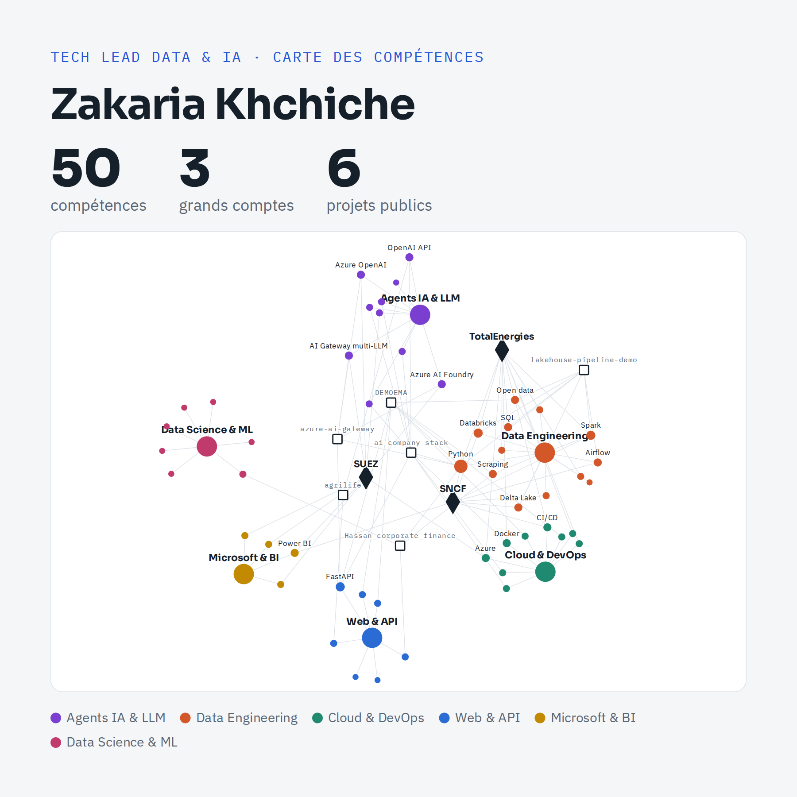

# Zakaria Khchiche

### Tech Lead Data & IA · Agents IA · Data Engineering

J'aide les grands comptes à transformer leurs cas d'usage IA en solutions **en production** : fiables, sécurisées et aux coûts maîtrisés.

📄 [Télécharger le carrousel (PDF, 6 slides)](assets/carrousel-linkedin-zakaria-khchiche.pdf)

## Ce que je fais

- **Agents IA & IA générative** : conception d'agents et d'assistants conversationnels (Azure AI Foundry, Azure OpenAI, Copilot Studio), orchestration d'agents, intégration au SI (SharePoint, Dataverse, API métiers)
- **Socle IA** : AI Gateway, routage multi-LLM (coût, latence, sensibilité des données), observabilité, évaluation, maîtrise des coûts
- **Data Engineering** : pipelines Databricks, Spark, Airflow, Prefect, Lakehouse Delta, Denodo
- **Cloud & DevOps** : Azure, AWS, Docker, Kubernetes, CI/CD
- **Automatisation & BI** : Power Platform, Power Automate, Power BI

## Formations

Formateur IA avec **Spar-x** (organisme certifié Qualiopi, formations finançables par votre OPCO), en sessions de 20 personnes maximum :

- [Formation Copilot Studio : créer des agents IA en production](https://zakariakhchiche.github.io/formation-copilot-studio/)
- [Formation IA générative en entreprise](https://zakariakhchiche.github.io/formation-ia-generative/)
- [Kit AI Act article 4 gratuit](https://zakariakhchiche.github.io/kit-ai-act/) : diagnostic en 10 questions et registre des formations IA
Vidéos et podcast « Agents IA en production » : [youtube.com/@zakariakhchiche](https://www.youtube.com/@zakariakhchiche)

## Références

SUEZ · TotalEnergies · Groupe SNCF · La Banque Postale · Les Mousquetaires (Stime) · Volvo Group · SAUR

## Contributions open source

**OGX (ex-Llama Stack, Meta)** : audit du framework et correction de 3 bugs silencieux en production. Les deux correctifs ont été **fusionnés par les mainteneurs** le 1er octobre 2026.

- Recherche hybride Elasticsearch : paramètre RRF ignoré → [PR #6697](https://github.com/ogx-ai/ogx/pull/6697) ✅ fusionnée
- RAG pgvector : filtres IN / NOT IN inopérants sur booléens et nombres → [PR #6698](https://github.com/ogx-ai/ogx/pull/6698) ✅ fusionnée
- API Responses : tokens en cache et de raisonnement sous-comptés → [issue #6699](https://github.com/ogx-ai/ogx/issues/6699) ✅ résolue
- RAG Weaviate : réindexer un document créait des doublons au lieu de remplacer l'ancienne version → [PR #6705](https://github.com/ogx-ai/ogx/pull/6705) ✅ fusionnée

Article : [3 bugs silencieux dans un framework d'agents IA open source](https://medium.com/@ZKHCHICHE/3-bugs-silencieux-dans-un-framework-dagents-ia-open-source-10a86cd31dff) (FR) · [Three silent bugs in an open-source AI agent framework](https://dev.to/zakaria_khchiche_490919ed/three-silent-bugs-in-an-open-source-ai-agent-framework-igd) (EN)

## Stack

## Me contacter

Disponible pour des missions de Tech Lead IA/Data, de conception d'agents IA et d'industrialisation de POC d'IA générative (Paris ou hybride).
 · [YouTube](https://www.youtube.com/@zakariakhchiche)
[Mon profil Malt](https://www.malt.fr/profile/zakariakhchiche) · [LinkedIn](https://www.linkedin.com/in/zakariakhchiche) · [Medium](https://medium.com/@ZKHCHICHE)

proofseen-verification=d96e7a1370a2bb39f71a79b491795bb0
